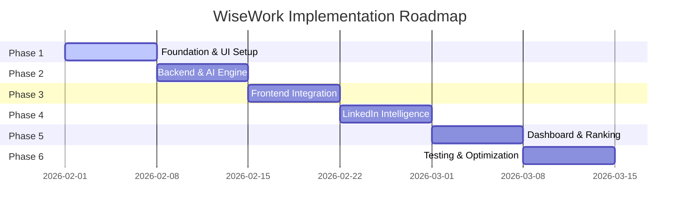

<div align="center">


# 🧠 WiseWork: AI Resume & CV Evaluator

[](https://reactjs.org/)
[](https://www.typescriptlang.org/)
[](https://nodejs.org/)
[](https://vitejs.dev/)

**Empowering Recruitment with Intelligent Automation and Deep Candidate Insights.**

[Overview](#-overview) • [Key Features](#-key-features) • [Tech Stack](#-tech-stack) • [Roadmap](#-6-week-timeline) • [Setup](#-getting-started)

</div>

---

## 📖 Overview

**WiseWork** is a state-of-the-art AI-powered recruitment engine designed to eliminate the manual bottleneck of screening resumes. By leveraging advanced Large Language Models, WiseWork parses, analyzes, and ranks candidates with surgical precision, providing recruiters with actionable insights and a holistic view of every profile—including LinkedIn integration.

---

## ✨ Key Features

- **🚀 Multi-CV Batch Processing**: Instantly upload and analyze dozens of resumes in parallel.
- **🎯 Intelligent Scoring (0-100)**: Proprietary AI ranking based on custom job descriptions or project requirements.
- **🔍 Deep Skill Extraction**: Automated identification of core competencies, gaps, and hidden potential.
- **🔗 LinkedIn Synergy**: Summarize professional trajectors and cross-reference CV data with live LinkedIn profiles.
- **💎 Premium UX**: A sleek, dark-themed dashboard with glassmorphism components and fluid micro-animations.

---

## 🛠️ Tech Stack

### Frontend
- **Framework**: `React 18` + `TypeScript`
- **Build Tool**: `Vite`
- **Styling**: `Vanilla CSS` (Custom Glassmorphism Design System)
- **Animations**: `Framer Motion` / `CSS Transitions`

### Backend
- **Runtime**: `Node.js` + `TypeScript`
- **Server**: `Express.js`
- **AI Logic**: `OpenAI API` / `Google Gemini API`
- **File Parsing**: `pdf-parse`

---

## 📅 6-Week Timeline



| Week | Milestone | Deliverables |
| :--- | :--- | :--- |
| **W1** | **Foundation** | UI Design System, Project Scaffolding |
| **W2** | **AI Engine** | LLM Integration, PDF Parsing Service |
| **W3** | **Architecture** | File Upload API, Real-time Loading UI |
| **W4** | **Connectivity** | LinkedIn Profile Scraper/Summarizer |
| **W5** | **Intelligence** | Dynamic Ranking Algorithm, Final Dashboard |
| **W6** | **Polish** | Performance Tuning, Final Documentation |

---

## 🛠️ Getting Started

### 1️⃣ Clone the Repository
```bash
git clone https://github.com/your-username/wisework-ai.git
cd wisework-ai
```

### 2️⃣ Environment Configuration
Create a `.env` file in the `server` directory:
```env
PORT=5000
AI_API_KEY=your_secret_key_here
```

### 3️⃣ Installation & Boot
```bash
# Install dependencies
npm run install:all

# Launch Development Servers
npm run dev
```

---

<div align="center">
  <sub>Built with ❤️ for Excellence in AI Recruitment.</sub>
</div>